# Chakravyuh — an agentic fraud investigator on TigerGraph

**Chakravyuh** (चक्रव्यूह) is the spiral battle formation of the Mahabharata: easy to enter, built so that whoever walks in is surrounded ring by ring. This agent investigates the same way — from the flagged transaction outward to the card, the real cardholder behind it, the device, the other cards that device touched, and the bank's past cases — until the fraud has nowhere left to hide, or the alert is cleared.

It takes a fraud alert — a model score, a customer complaint or an analyst request — and runs the whole investigation a fraud analyst would: it opens the case, walks the graph, recalls the bank's past cases, decides what kind of fraud it is and how far it goes, asks for more evidence when the signal is weak, recommends the next best actions with the approval each one needs, writes the suspicious activity report when policy requires one, and writes the finished case back into the graph so the next investigation can find it.

Built for **Hacker House Goa 2026** — the TigerGraph *Agentic Fraud Investigation & Next-Best Action* challenge (HHGOA 2026).

**Live console:** `<Streamlit URL>` · **Demo video:** `<video link>` · **Blog:** `<blog link>` · **Answer files:** [`cases/`](cases/)

## Results on the 20 benchmark cases

| | |
|---|---|
| Verdicts | **9 fraud · 10 legitimate · 1 uncertain** (HHG-002 stays open under R4: the customer never replied) |
| Hidden schemes | **2 undocumented patterns** found and described in the agent's own words: purchases just under $500 repeated on 12 cards (HHG-006), and one proxy phone profile behind a 28-card ring (HHG-014) |
| Asking before acting | Evidence requested in **12 cases** (5 customer checks, 3 one-time passcodes, 4 analyst confirmations); the recommendation was updated after the answer in all 12 |
| Reports | **4 suspicious activity reports**, only where policy section 3a requires one |
| TigerGraph | Every graph call served by TigerGraph through MCP (installed GSQL, TigerVector search, and the GDS `tg_wcc` algorithm); every case written back as an `INV-HHG-0xx` vertex |
| Writing | In the committed run Groq `openai/gpt-oss-120b` wrote 7 cases (HHG-001–005, 007, 016); when it hit its daily token cap the failover handed the other 13 to `openai/gpt-oss-20b`. Every text passes the ID and accuracy guards or falls back to the deterministic writer (the SARs of HHG-006 and HHG-014 did); each trace's `writer` field records which |
| Learning from history | Replaying the bank's closed cases lifted accuracy on decided cases from **49% to 66%** out of time (AUC 0.45 → 0.66) |
| Beyond the 20 | The agent monitors November–December by itself: **14 self-raised investigations** and **85 multi-device rings** from graph connected components (`monitoring/`) |

```mermaid
flowchart LR
  T[Trigger<br/>risk score · customer report · analyst] --> I[intake]
  I --> G[gather evidence<br/>installed GSQL via MCP]
  G --> M[recall memory<br/>fingerprint · card · vector search]
  M --> F[follow-up<br/>LLM picks extra graph calls<br/>when other cards are linked]
  F --> A[assess<br/>log-odds evidence model]
  A --> D1[initial next-best action<br/>Policy R1–R10 + routes]
  D1 -->|uncertain| R[request evidence<br/>step-up · customer · analyst]
  R --> D2[final next-best action]
  D1 -->|decisive| D2
  D2 --> E[explain<br/>GraphRAG + LLM, ID-checked]
  E --> GA[graph algorithm<br/>GDS tg_wcc, context only]
  GA --> W[write InvestigationCase<br/>back to TigerGraph]
```



## What makes it work

* **Recovered identities.** `card_id` is not in the transaction file. Chakravyuh reconstructs it (rank of `card6` within the customer — matches all 5,565 closed cases), and derives a finer **card fingerprint** (card + billing region + account-start day + email domain). A "customer" in this data can be thousands of transactions from many people; the fingerprint is who is actually using the card. In the closed history, fingerprints are almost never both confirmed-fraud and cleared, which makes fingerprint-level case memory the strongest single signal.
* **Graph patterns, not row scores.** Shared-origin rings (a rare device profile with coherent activity across several cards), threshold structuring (runs of $400–$500 purchases that repeat across customers), card testing, recurring-charge disputes, region novelty — each is a GSQL query and a detector.
* **A TigerGraph graph algorithm, on the right graph.** The unmodified GDS `tg_wcc` (weakly connected components) runs over a projection that links each *card-in-use* (fingerprint) to the rare device profiles it used in Nov–Dec. Linking whole cards instead merged 5,103 cards into one uninformative component, because a card here is shared by many people; the card-in-use isolates genuine rings (HHG-014: 28 cards on one proxy device; HHG-019: 5 cards). Each case shows its component as weight-0 evidence (context, never scored; `tests/test_graph_algorithm.py` proves every decision is identical without it), and the monitor lists 85 multi-device rings the single-device scan cannot see.
* **Policy as code.** Rules R1–R10, section 3a (case vs report), approval routing (auto / L1 / L2) and the stopping rule are implemented literally; every action carries its route and the rule that justifies it.
* **Memory-calibrated.** `scripts/calibrate.py` replays the closed cases (no look-ahead) and learns how much each detector really means for a model alert; `scripts/backtest.py` scores the agent on a later window. The agent quotes that history inside its evidence.
* **Controls, not just labels.** An action gateway executes only `auto` actions (through mock APIs) and queues L1/L2 actions for a team lead or fraud manager; every dispatch is recorded on the case timeline.
* **A living case record.** The `InvestigationCase` vertex is written when the case opens and updated when it closes, with a full timeline of stages, so later investigations (including the agent's own) can find it.
* **Plans for every answer.** Before asking a customer anything, the agent computes its recommendation for a denial, a confirmation and silence; a confirmation that contradicts strong graph evidence escalates under R8 instead of closing.
* **Always completes.** Every call goes to TigerGraph through MCP; if one call fails, that call alone is served by the offline mirror and marked `local-fallback` in the trace (`--strict` turns this off).
* **The LLM does language, not the verdict.** When other cards are linked it picks follow-up graph calls, and it writes summaries and SAR narratives from retrieved evidence and policy passages. Every ID it writes is checked against the evidence; if it invents one, the deterministic writer is used.
* **LLM failover.** Groq `openai/gpt-oss-120b` is primary, then an optional second Groq model (`GROQ_BACKUP_MODEL`, e.g. `openai/gpt-oss-20b`: Groq's per-minute token budget is per model), then Gemini `gemini-3.6-flash`. A 429/503 is retried on the same provider with backoff (honouring Retry-After), then the request fails over; a hard error (401/403/404) disables a provider for the run, and four failures in a row cool it down for 90 s. If all are down, the deterministic writer is used. Each trace's `writer` field records the model that actually wrote that case.

## How it meets the judging criteria

The official challenge brief is in [`docs/challenge_brief.md`](docs/challenge_brief.md).

See [`docs/judging_map.md`](docs/judging_map.md): each of the 11 "what success looks like" points, the code that implements it, and where to see it in the console.

## Quick start

```bash
git clone https://github.com/Tanmay2006-Tech/chakravyuh-fraud-agent && cd chakravyuh-fraud-agent
python -m venv .venv && source .venv/bin/activate      # Windows: .venv\Scripts\activate
pip install -r requirements.txt
cp .env.example .env                                     # fill in TG_* and an LLM key

# 1. put the dataset folder at data/HHGOA_IEEE/, then derive entities + loading files (~2 min)
python prepare/build_dataset.py

# 2. create schema, vector attributes, load data, embed, install queries — all through TigerGraph MCP
python scripts/check_mcp.py              # confirms the MCP server can reach your workspace
python scripts/setup_tigergraph.py       # resume a step with --from load|knowledge|embed|queries|algorithms
python scripts/doctor.py                 # runs every installed query once; all 15 should say OK

# 3. investigate the 20 cases (writes cases/*.json, traces/*.json and InvestigationCase vertices)
#    re-running? reset the agent's own case memory first, or it will recall the previous run's cases as evidence
python scripts/reset_case_memory.py --delete   # only INV-HHG-001..020 / INV-MON-001..014; dry run without --delete
python run_cases.py --backend tigergraph       # --pause N (default 5 s) between cases keeps free-tier LLMs under their limits
python scripts/validate_answers.py

# 4. analyst console
streamlit run ui/app.py

# tests: the full TigerGraph/MCP code path against TigerGraph-shaped responses (no server needed)
python -m tests.test_tigergraph_path
python -m tests.test_graph_algorithm     # the tg_wcc evidence changes no decision
python -m tests.run_all                  # every offline check: answer files, MCP path, graph algorithm, LLM failover, UI

# memory calibration + out-of-time backtest (offline, a few minutes each)
python scripts/calibrate.py && python scripts/backtest.py --n 400

# optional: let the agent watch Nov–Dec on its own (Innovation)
python monitor.py --backend tigergraph
```

## Live demo (Streamlit Community Cloud)

1. Push the repo (after the TigerGraph run, so `cases/` and `traces/` hold the final results).
2. Go to share.streamlit.io, sign in with GitHub, choose **Create app → Deploy a public app from GitHub**.
3. Repository `Tanmay2006-Tech/chakravyuh-fraud-agent`, branch `main`, main file path `ui/app.py`, and pick a custom URL such as `chakravyuh-hhgoa`.
4. Deploy. No secrets are needed: the live app shows the recorded investigations. (It installs `ui/requirements.txt`, not the full agent stack.)

No workspace handy? `python run_cases.py --backend local --embedder hashed` runs the same agent against an offline mirror of the graph tools (same contracts as the GSQL queries).

**Savanna notes:** create a TigerGraph **4.2+** workspace (vector search needs it), enable auto-stop and auto-start, create a database user under *Access Management*, and put the workspace host (`https://…i.tgcloud.io`) and credentials in `.env`.

## Repository

| Path | What it is |
|---|---|
| `prepare/build_dataset.py` | Card IDs, fingerprints, device profiles; TigerGraph loading CSVs |
| `tigergraph/schema.gsql`, `loading_jobs.gsql` | 11 vertex types, 13 edge types (incl. the `USES_DEVICE` projection), 3 loading jobs |
| `tigergraph/queries/*.gsql` | 13 installed queries: transaction context, card profile, card window, fingerprint history, device neighbours, amount recurrence, case memory, threshold scan, shared-device scan, two TigerVector searches, and two readers of the `tg_wcc` result (`ring_component`, `wcc_ring_scan`) |
| `tigergraph/algorithms/` | `tg_wcc.gsql`, byte-identical to the TigerGraph GDS library, and `build_uses_device.gsql`, the projection it runs on |
| `agent/backends/mcp_tigergraph.py` | Every graph read and write goes through the TigerGraph MCP server |
| `agent/detectors.py` | Evidence detectors → signals with log-odds weights and entity IDs |
| `agent/assess.py` | Probability, pattern, fraud episode |
| `agent/policy.py` | Fraud Policy v1.0 as code |
| `agent/simulator.py` | Explicit, deterministic assumptions for customer/analyst replies |
| `agent/workflow.py` | LangGraph state machine |
| `agent/knowledge.py`, `agent/llm.py` | GraphRAG knowledge base, embeddings, Groq/Gemini |
| `cases/` | The 20 answer files |
| `monitoring/` | Self-raised investigations beyond the case pack |
| `ui/app.py` | Analyst console: the 20 cases, each case drawn as investigation rings, plain-language verdict, actions with an approval queue, the plan for every customer answer, evidence, step-by-step trace, SAR |
| `scripts/doctor.py`, `tests/` | Live query check through MCP; offline end-to-end test of the TigerGraph code path |
| `scripts/calibrate.py`, `scripts/backtest.py` | Case-memory calibration and no-look-ahead backtest (`docs/backtest*.json`, one row per replayed case in `docs/backtest_rows.csv`) |
| `docs/` | Blog post, demo script, social post |
